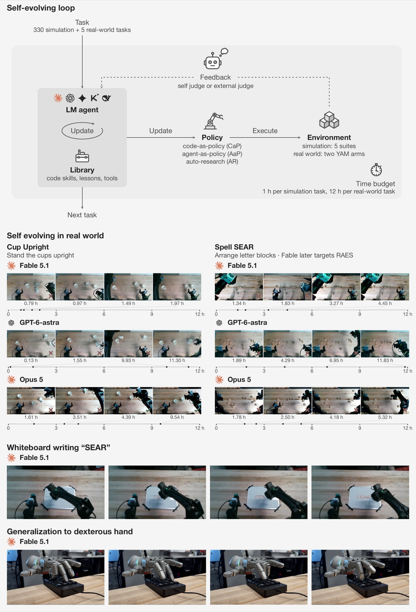
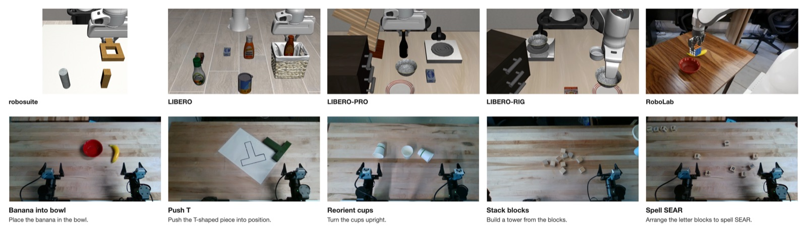

<div align="center">

# SEAR: Self-Evolving Agentic Robotics

**A framework and benchmark for robotic agents that improve from their own experience.**

[Xinyi Wang](https://wangxinyilinda.github.io/)<sup>\*,†</sup> ·
[Bangzheng Li](https://www.libangzheng.com/)<sup>\*,†</sup> ·
[Hanyu Wang](https://hywang66.github.io/)<sup>‡</sup> ·
[Lin Zhang](https://lzhangbj.github.io/) ·
[Andrea Yaoyun Cui](https://andreayyc.github.io/) ·
[Zhenggang Tang](https://recordmp3.github.io/) ·
[Shyamal Buch](https://cs.stanford.edu/~shyamal/)<sup>§</sup> ·
[Dejia Xu](https://ir1d.github.io/)<sup>†,§</sup>

**Luma AI**

<sub><sup>\*</sup> Co-first authors &nbsp;·&nbsp; <sup>†</sup> Project leads &nbsp;·&nbsp; <sup>‡</sup> Real robot lead &nbsp;·&nbsp; <sup>§</sup> Co-last authors</sub>

<br>

[](https://sear.bot/)
[](#release-plan)
[](#release-plan)
[](LICENSE)

</div>

<br>

> [!NOTE]
> **The code is on its way.** Watch or star the repo to get notified when it lands.

<p align="center">
  
</p>

## Overview

Frontier language agents can now improve a robot from its own experience: they write control code, maintain skills and memories, and train action models on their own rollouts. But when an agent's success rises with more interaction, where does the gain come from, and how far does it reach?

**SEAR** is a framework and benchmark for answering these questions. Its harness connects a language agent with perception and control tools and a persistent library of skills and memories, and runs the same way on simulated and physical robots. The agent can deliver its policy in three forms:

- **Code-as-policy (CaP):** as a program the agent writes and revises.
- **Auto-research (AR):** as a trained checkpoint, by fine-tuning a VLA on its own rollouts.
- **Agent-as-policy (AaP):** as itself, staying in the control loop and choosing actions from live observations.

<div align="center">

| 1.9 years | 5 | 330 | 2 | 5 |
| :-: | :-: | :-: | :-: | :-: |
| of agent runtime | frontier models | simulated tasks | physics engines | physical tasks |

</div>

## Why a new benchmark?

A rising success rate does not mean the agent is learning. SEAR pairs each alternative explanation with a matched control:

| The gain might come from… | SEAR's control |
| :-- | :-- |
| Trying more often | Budget-matched best-of-*N* restarts |
| A longer session rather than retained experience | A no-library baseline |
| Practicing on states it will be tested on | A five-tier generalization ladder |
| Reading privileged simulator state | A sealed judge the agent cannot access |
| A lucky run | Replicated lineages from the same configuration |
| Spending more compute | A resource ledger beside wall-clock time |

**The generalization ladder.** T1: new initial states → T2: new conditions → T3: new tasks → T4: new simulator → T5: the real world.

## Testbed

<p align="center">
  
</p>

- **Simulation:** 330 tasks in five families on two physics engines, ordered from easiest to hardest: **robosuite**, **LIBERO**, **LIBERO-PRO**, and **LIBERO-RIG** on MuJoCo, and **RoboLab** on Isaac Sim. LIBERO-RIG is new: it keeps each task fixed and perturbs only the robot hardware and its setup.
- **Real world:** two YAM-Ultra arms with five tabletop tasks: Banana into Bowl, Push-T, Cup Upright, Block Stacking, and Spell "SEAR".

## Key findings

1. **Base-model capability sets the floor and the ceiling.** A model that rarely writes a working policy has nothing to save. Above that floor, the five models rank in the same order under every protocol, and the gap between best and worst grows with task difficulty, from 12 points to 43. Vision is not what separates them: the one text-only model, given segmentation and depth tools, beats the nearest multimodal model on the hardest family.
2. **Longer sessions and inherited experience both help, but only inherited experience transfers.** An inherited library moves first success earlier and adds 7 to 18 points to weaker models on the practiced task. It is the only source of gain that survives a change of task or simulator, and what transfers is control code and shared routines, not perception code or task-specific solutions.
3. **The library carries mistakes forward along with skills.** Identically configured lineages diverge by more than the gap between models. On hardware, ten consecutive practice successes do not predict held-out success, and the best model depends on the policy form: the model that dominates in code-as-policy does worse in agent-as-policy.

## Release plan

- [x] Paper and project website
- [ ] Code release

## Citation

If you find SEAR useful, please cite:

```bibtex
@article{wang2026sear,
  title   = {{SEAR}: Self-Evolving Agentic Robotics},
  author  = {Wang, Xinyi and Li, Bangzheng and Wang, Hanyu and Zhang, Lin and
             Cui, Andrea Yaoyun and Tang, Zhenggang and Buch, Shyamal and Xu, Dejia},
  year    = {2026}
}
```

## License

Released under the [MIT License](LICENSE).
